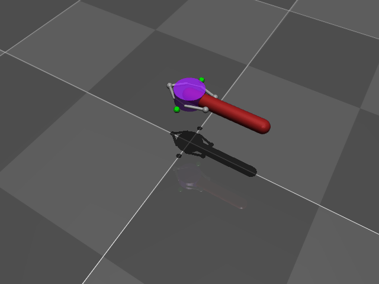
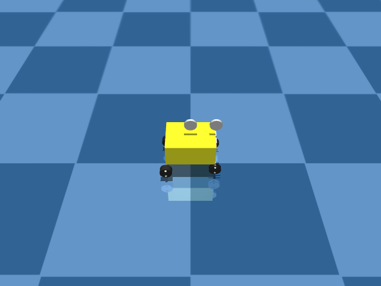

# Included Environments

## Co-Contraction of Muscle Model
SISO system.

*Action*: Amount of Muscle Stimuli. Unitless. $[-\infty, \infty]$

*Observation*: Angle of Segment / Endeffector. In Degrees. $[-120^\circ, 120^\circ]$



## Rover with Ackerman Steering
SISO system. The rover drives along the x-axis. The rover will never make a turn. There is a condition which will overwrite the actions before this can happen.

Copied and modified from https://github.com/griloHBG/Rover4We.

*Action*: Steering Wheel Angle. Unitless. $[-\infty, \infty]$

*Observation*: Cartesian $y$-position of the rover. Unitless.



Additionally, one can modifiy the amount of drive motor input aka thrust. This can be done using 

```python
# `drive` is in [-1.0, 1.0]
env = make_env("rover", task_kwargs={"drive": 0.5})
```

With a negative `drive` the rover drives backwards.


