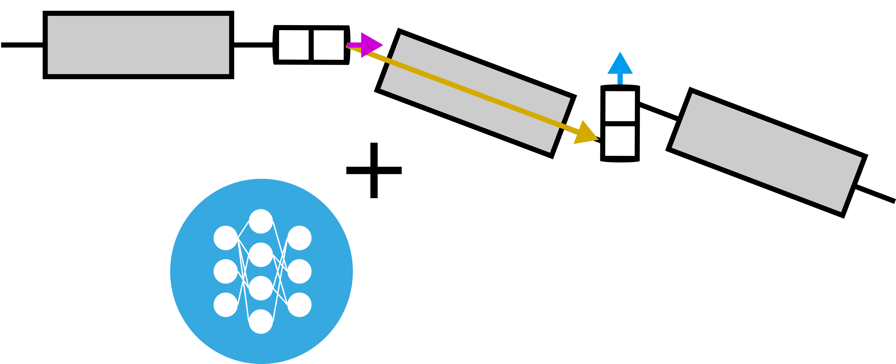

# Chain Control (cc)

This package provides components to 
- simulate kinematic chains
- define and train a model of the dynamics
- define and train a controller that tracks a reference with the help of a model
- visualize the controller performance

A key concept is that models but also controllers are neural ODEs that are trained using gradient descent.

## Installation

Make sure that you first fulfill the following dependencies
- Requirements of `dm_control` under `Rendering` (https://github.com/deepmind/dm_control)
- `RecordVideoWrapper` requires `ffmpeg` to be available in terminal

### Steps

- create & activate new conda environment with Python 3.9
- git clone this repository
- in root of this repository (where `setup.py` is located) execute `pip install -e .`

## Documentation

Check out the five introductory notebooks located under /docs

## Modules

- cc.env.
    - envs 
        
        Contains the different simulation setups. Each setup consists of two files. `env_id.py` and `env_id.xml`
    - wrappers

        Contains many useful wrappers that modifies a simulation setup (or an Environment).

    - ...

## Bugfixes

    Bug: "Mujoco-Lib could not be found"
    Solution: Re-install `dm_control`
    Steps:
        - pip uninstall dm_control
        - pip install dm_control
